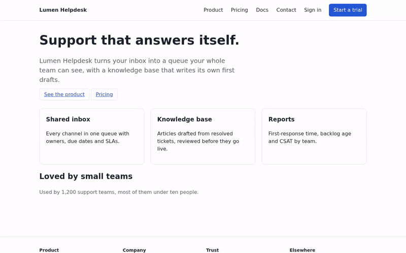

# persona-drive

Persona-based browser testing. You describe a person and what they came to do; Jev
decides what that person would do next on each screen; Playwright does it; the run is
recorded as video, screenshots, a step log and a report of where the person got
confused, got stuck, or hit something broken.

```
personas/first-time-buyer.yaml                         targets/sample-app.yaml
  name: Maya Chen                                        baseUrl: http://localhost:3000
  role: Office manager choosing a helpdesk tool          main: main#main
  cares: Answers support email herself between other jobs …
  goals:
    - id: soc2
      text: Find out whether the vendor has a SOC 2 report and how to get it.
```

```
$ npx persona-drive run --target targets/sample-app.yaml --persona personas/first-time-buyer.yaml
pricing 1/40 / link "Pricing" (P 1.00) -> went to /pricing.html
pricing 2/40 /pricing.html done (P 0.97) -> chose done
session-length 1/40 / link "Docs" (P 0.62) -> went to /docs.html
session-length 2/40 /docs.html link "Single sign-on and sessions" (P 0.95) -> went to /docs-sso.html
session-length 3/40 /docs-sso.html done (P 0.99) -> chose done
…
runs/2026-09-28T17-40-12-101Z-sample-app-maya-chen/report.md
```

Nobody scripted a path; nobody told the persona where to look. When the persona cannot
find something, or finds it and is confused, or trips over a page error, that is the
finding.

## Demo



Two personas on the bundled sample site, recorded with `persona-drive run`. Nobody
scripted a path; Jev chose every step from the persona, the goal and the text of the
screen. Full step tables, videos and reports are in [`demo/`](demo/README.md).

| persona               | goal                | what happened                                                                       | steps | band   |
| --------------------- | ------------------- | ----------------------------------------------------------------------------------- | ----: | ------ |
| Maya, office manager  | pricing             | Nav → Pricing, done                                                                 |     2 | OK     |
| Maya                  | soc2                | Footer → Security ("report under NDA") → Contact and back, four times; gave up      |    15 | FAIL   |
| Maya                  | data-picture        | Security → subprocessors list; both parts met                                       |     3 | OK     |
| Maya                  | contact (writes)    | Chose "Request a demo", filled the form, sent                                       |     6 | OK     |
| Tomasz, support agent | find-ticket         | "Open TCK-1042", done                                                               |     2 | REVIEW |
| Tomasz                | export (writes)     | Export CSV three times: 500 each time, a page error, then stuck                     |     9 | FAIL   |
| Tomasz                | new-ticket (writes) | Submitted the empty form, then typed the title from the goal and created the ticket |    13 | REVIEW |

Both runs: 60 Jev calls, under a cent, 40 seconds of browser time. The SOC 2 dead end
was not planned into the sample; the tool found it. REVIEW on the ticket list is the
`layoutBug` Noul reacting to the clipped titles and the 1.8:1 "Due" column, both
deliberate.

The same persona can also be driven by Claude Code, with Jev still deciding every
step: [`demo/claude-code-session/`](demo/claude-code-session/) is one recorded session
(4 steps to the goal, 45 seconds, $0.32 of Claude and $0.0005 of Jev).

## How it works

This is the loop the [Jev Minecraft agents](https://typesafe.ai) run, applied to a web
application: code owns perception and execution, Jev owns one bounded decision per
tick.

1. **Perceive in text.** Each screen is captured as Playwright's accessibility snapshot
   of the content region (and of the topmost dialog), the alerts on it, and a list of
   layout facts computed from the DOM: controls drawn over each other, clipped text,
   misaligned table columns, low contrast, a focused element off screen, a loading
   indicator that never went away. Jev never sees pixels.
2. **Enumerate the options.** The snapshot's buttons, links, tabs, fields and selects
   become at most 50 numbered controls (navigation gets a guaranteed share, a table's
   repeated row actions are collapsed, a native select's options are spelled out, and
   an identifier or quoted phrase in the goal becomes something to type into a search
   field), plus `wait`, `scroll_down`, `go_back`, `done` and `stuck`.
3. **Ask Jev once.** One request carries the persona, the goal, the screen, the last
   eight actions with their outcomes, the routes visited so far, and the options. It
   answers a Choice (`next`) and a few Nouls: `goalMet` (or one per unmet part of a
   parts goal), `confusing`, `layoutBug`, `userVisibleError`, and `destructive` for
   any control it has not judged yet. About half a second and a few hundredths of a
   cent per step.
4. **Act and record.** Code performs the option, settles the screen, writes what it
   saw happen in one line (`went to /pricing.html`, `opened dialog "Sign in"`,
   `saved: POST /api/todos 201`, `blocked write POST /api/notes`), and repeats until
   Jev says `done`, says `stuck` twice, or the step or dollar budget runs out.
5. **Band the goal.** FAIL is deterministic (a blocked write on a read-only goal, a
   page error, a 5xx, a stuck loader, a failed action, Jev stuck). LIKELY and REVIEW
   read Jev's answers against thresholds in `src/thresholds.ts`. Every reason is listed.

Guards that make this safe to point at a real site: controls whose name says delete,
remove, sign out, revoke, archive, reset or unsubscribe are never offered; links that
leave the origin are never offered; a read-only goal blocks every state-changing
request to the site and records the attempt as a FAIL; script dialogs are dismissed,
never accepted; an option taken three times from one screen, or that has led back
to an already visited screen three times, is withdrawn so a loop cannot burn the
budget; everything Jev reads and everything written to disk has session cookies,
bearer tokens, JWTs, presigned URLs and email addresses redacted first.

## Quick start

You need a [TypeSafe](https://typesafe.ai) API key for Jev. Nothing else: no GPU, no
display, no account on the site under test.

**With Docker** (the image carries Chromium, the tool and a sample site to test):

```sh
git clone https://github.com/zovos-ai-inc/persona-drive && cd persona-drive
echo TYPESAFE_API_KEY=… > .env
docker compose run --rm persona-drive run --target targets/sample-app.yaml --persona personas/first-time-buyer.yaml
docker compose run --rm persona-drive run --target targets/sample-app.yaml --persona personas/support-agent.yaml --allow-writes
```

Runs land in `./runs`. To watch the persona work, start the `watch` profile, which adds a
headed Chromium on a virtual display with noVNC at http://localhost:6080/vnc.html, and
point runs at it:

```sh
docker compose --profile watch up -d browser
PERSONA_DRIVE_BROWSER_WS=ws://localhost:3100/ docker compose run --rm persona-drive run --target targets/sample-app.yaml --persona personas/support-agent.yaml
```

Your own site: write a target file (base URL, content-region selector, sign-in hook) and
a persona file, keep them in `targets/` and `personas/` (mounted into the container),
and give the containers a route to the site: `--base http://host.docker.internal:8080`
for something running on the host, or add its service to the compose file.

**Without Docker** (Node 22 or later), from a checkout:

```sh
npm ci
npx playwright install --with-deps chromium
export TYPESAFE_API_KEY=…
node sample-app/serve.mjs &                     # the bundled site on :3000
npx persona-drive run --target targets/sample-app.yaml --persona personas/first-time-buyer.yaml
npx persona-drive run --target targets/todomvc.yaml --persona personas/todo-first-timer.yaml --allow-writes
npx persona-drive smoke                         # one Jev call, to check the key
```

Or as a package in your own project: `npm install -D @zovos-ai-inc/persona-drive`, then
`npx persona-drive …` with your own `personas/` and `targets/` directories (the
shipped examples come with the package).

`run` writes `runs/<timestamp>-<target>-<persona>/` with `report.md`, `run.json`,
`results.jsonl`, `jev-calls.jsonl`, and per goal `video.webm`, `steps.jsonl`, a
`step-NNN.json` (the exact state Jev judged) and `step-NNN.jpg` per step, and a
Playwright `trace.zip` when the goal banded FAIL or LIKELY. Set `PERSONA_DRIVE_OUT`
to write somewhere else.

Options: `--goal id,id` to run some goals, `--steps N` (default 40) and `--budget usd`
per run, `--seed N` for the values typed into fields the goal says nothing about,
`--base url` to point a target at another host, `--headed` to watch locally,
`--no-video` and `--no-screenshots` to save disk, `--allow-writes` to run
`writes: true` goals. `PERSONA_DRIVE_BROWSER_WS=ws://…` connects to any Playwright
browser server instead of launching Chromium.

### GPU, display, hardware

None needed. Chromium renders in software inside the container, and Playwright records
the video itself. A GPU only matters for WebGL-heavy pages or if you want hardware
video encoding on a box that runs many personas at once; pass `/dev/dri` into the
`browser` service if you have one. The `watch` profile exists so a person can see the
browser; the tool itself never needs to.

### The sample site

`sample-app/` is a fictional helpdesk product (marketing pages, docs, a contact form and
a small ticket app) with flaws left in on purpose: Security is linked only from the
footer, the ticket list has a low-contrast column, an ellipsis-clipped title and a
sync spinner that never finishes, the CSV export throws a page error, and the ticket
page has a real Delete button. Personas `first-time-buyer` and `support-agent` are
written for it.

## Personas and targets

See [`personas/README.md`](personas/README.md) and
[`targets/README.md`](targets/README.md). A persona is a name, a role, a paragraph
about what they care about, and their goals; Jev reads all of it on every step.
Exploratory goals ("Try everything on this screen a new user might try and note what
happens") turn the same loop into persona-shaped fuzzing: the destructive veto and
the read-only guard still hold. A
target is a base URL plus how to settle a screen and how to sign in: a Playwright
storage state, or a module that signs a fresh context in (the hook an application with
its own session scheme plugs into).

A goal with `parts` is judged one part at a time, each on the screen that shows it;
the goal is met when every part has been seen. Use it for goals that span screens
("the vendor module page, and the subprocessors list").

## Claude Code as the hands, Jev as the person

`persona-drive ask` is the same decision with no browser attached. Whatever holds the
browser (Claude Code with its browser tools, another agent, a person) takes an
accessibility snapshot, asks, performs the instruction, and asks again. The session
directory keeps the persona's memory between calls.

```sh
npx persona-drive ask --session runs/s1 --persona personas/first-time-buyer.yaml \
  --goal pricing --url http://localhost:3000/ --snapshot snapshot.yaml
{
  "step": 1,
  "next": { "id": "c04", "text": "link \"Pricing\"", "region": "navigation", "p": 1 },
  "goalMet": 0.02,
  "confusing": 0.48,
  "instruction": "Click the link \"Pricing\" in the navigation region."
}
```

The repo skill [`.claude/skills/persona-session`](.claude/skills/persona-session/SKILL.md)
tells Claude Code to run exactly that loop with Playwright MCP (`.mcp.json`), take a
screenshot whenever Jev flags confusion, and hand back a report. That is the pixel
tier: Jev judges the text of the screen and Claude looks at the picture only where Jev
says a person would have trouble. See [`demo/`](demo/) for a recorded session.

## Set up Claude Code

Four things, in order. Only the first two are required.

**1. The Jev key.** Sign up at [typesafe.ai](https://typesafe.ai), create an API key,
and export it in the shell Claude Code runs from:

```sh
echo 'export TYPESAFE_API_KEY=…' >> ~/.profile     # or ~/.zshrc; then open a new shell
npx persona-drive smoke                             # one Jev call: prints the answers and the cost
```

Claude Code's Bash tool inherits that environment, so `persona-drive ask` finds the
key. For Docker, put the same line in `.env` (`TYPESAFE_API_KEY=…`; the file is
ignored by git). Never paste the key into a persona file, a prompt or a commit.

**2. A browser Claude can drive.** The checkout's `.mcp.json` registers the
[Playwright MCP](https://github.com/microsoft/playwright-mcp) server for this project;
Claude Code asks you to approve it the first time you start it here. To have it in
every project instead:

```sh
claude mcp add --scope user playwright -- npx -y @playwright/mcp@latest
```

On a machine with no display (a server, a container) add `--headless` after
`@playwright/mcp@latest`, in `.mcp.json` or in that command. With a display, leave it
headed and watch.

**3. The skill.** Working inside this checkout, Claude Code loads
[`.claude/skills/persona-session`](.claude/skills/persona-session/SKILL.md) by
itself; the project's `.claude/settings.json` pre-approves `npx persona-drive`. Then:

> Run a persona session: personas/first-time-buyer.yaml, goal soc2, base URL
> http://localhost:3000, read-only.

To use the skill from another project, install the package there and copy the skill:

```sh
npm install -D @zovos-ai-inc/persona-drive
mkdir -p .claude/skills && cp -r node_modules/@zovos-ai-inc/persona-drive/.claude/skills/persona-session .claude/skills/
```

**4. Optional: the TypeSafe skill.** `persona-drive` makes every Jev call itself, so
Claude needs nothing else to run a session. If you want Claude to write new questions
or rubrics against the Jev API (a different `next` premise, another Noul in
`src/rubric.ts`), install TypeSafe's own skill, which carries the API reference:

```sh
claude plugin marketplace add typesafe-ai/skills
claude plugin install typesafe@typesafe-ai
```

**Non-interactive.** [`demo/claude-code-session/run.sh`](demo/claude-code-session/run.sh)
is the pattern for running a session from a script or CI: `claude --print` with
`--mcp-config`, `--allowedTools` limited to the browser tools and `persona-drive`,
and a turn and dollar budget.

## Thresholds and calibration

The cuts in `src/thresholds.ts` came from hand-labelled steps on one application. They
are a starting point for yours, not a measurement of it. Label thirty or so of your
own steps (the `step-NNN.json` files are the states Jev saw; `steps.jsonl` has its
answers), find where the labels separate, and move the cuts. `confusing` and
`layoutBug` raise REVIEW at most until you have done that.

## What it cannot see

Jev is text-only. A wrong icon, a wrong colour, an image that did not load, or a
layout problem the DOM facts do not describe will not be found by `run`. That is what
the Claude Code session is for. Neither replaces a person: they find what a person
would find in the first ten minutes, cheaply and every night.

## License

Apache-2.0. Maintained by [Zovos AI](https://github.com/zovos-ai-inc); contributions welcome, see
[CONTRIBUTING.md](CONTRIBUTING.md).
